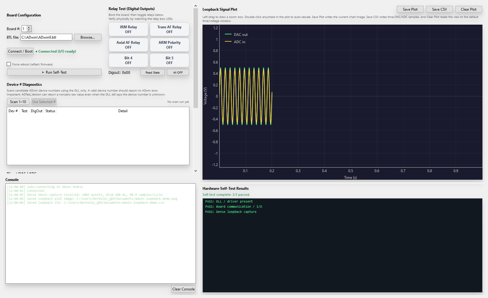
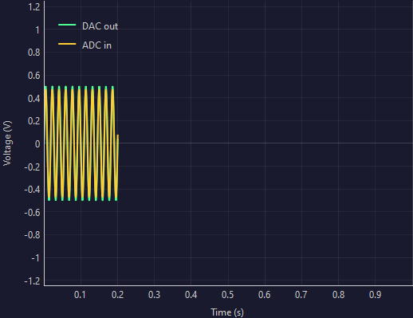

# RapidPy ADwin Communication Tester User Manual

This manual describes the current RapidPy ADwin Communication Tester as shipped in the RAPID repository in May 2026. It covers installation prerequisites, Windows 11 ADwin setup, the current dense ADwin-side loopback path, the full user interface, result export, and troubleshooting.

The Windows 11 installation guidance in this manual is based on the lab upgrade document Directions Windows 11 Upgrade for RAPID.docx / Windows 11 Upgrade Recipe v1.1, especially the ADwin software and post-upgrade recovery sections.

---

## 1. Purpose

The ADwin Communication Tester is the low-risk bench-test utility for the RAPID ADwin subsystem. Use it to verify that:

- the ADwin Windows runtime is installed correctly,
- the board can be found and booted,
- the configured device number is correct,
- digital outputs drive the relay lines correctly,
- direct DAC and ADC channels are working,
- the legacy ADwin sine process can run on the board at a meaningful hardware-timed I/O rate,
- dense capture results can be saved as a plot image and as CSV data.

This app is intended for communications testing and loopback verification before connecting the amplifier or AF coils.

It is not the AF tuning UI, and it does not perform a full demagnetization run by itself.

---

## 2. Safety and Scope

Before using this tool:

- Do not connect the power amplifier or AF coils while running DAC, ADC, or sine loopback tests.
- For analog testing, use only a short DAC to ADC patch cable.
- Treat the relay panel as a logic and wiring test, not as permission to energize the instrument rack.
- Return relay outputs to OFF when done.
- Return the DAC to 0 V when done with spot checks.

Recommended safe bench setup:

- ADwin powered on.
- USB or Ethernet connected.
- Relay box connected if digital-output verification is needed.
- One short BNC patch cable for DAC to ADC loopback.
- No amplifier or coil chain connected during loopback work.

---

## 3. Required Hardware, Software, and Files

### 3.1 Hardware

| Item | Purpose |
|---|---|
| ADwin board compatible with the RAPID system | Real-time DAC, ADC, and digital I/O hardware |
| Windows 10 or Windows 11 PC | Hosts the ADwin runtime and RapidPy app |
| USB-B cable or configured Ethernet link | Connection to the ADwin board |
| Short DAC to ADC patch cable | Analog loopback testing |
| Relay box connection | Optional relay verification |

### 3.2 Software

| Item | Purpose |
|---|---|
| ADwin Windows software package | Installs the ADwin DLLs, drivers, Adconfig, and boot files |
| RapidPy ADwin Communication Tester | Operator and diagnostic UI |
| Python / conda `paleomag` environment | Needed only for source-tree development runs |

### 3.3 Required runtime files

| File | Typical location | Why it matters |
|---|---|---|
| `adwin64.dll` | `C:\Windows\adwin64.dll` | Primary Windows DLL used by 64-bit RapidPy |
| `adwin32.dll` | Also installed by ADwin package | Used indirectly by some ADwin runtime layers and legacy tooling |
| `ADwin9.btl` | Usually `C:\ADwin\BTL\ADwin9.btl` or `C:\ADwin\ADwin9.btl` | Firmware / OS image booted onto the board |
| `sineout.T91` | `VB6/ADwin/sineout.T91` in the source tree | Compiled ADwin process used for dense board-timed sine capture |
| `~/.rapidpy_adwin_comms.json` | User home directory | Stores last-used ADwin tester settings |

Important details:

- ADwin does not appear as a COM port for this application. The app talks to the ADwin DLL stack directly.
- The dense loopback test uses the compiled ADwin process `sineout.T91`, not the `.abp` project file.
- In source-tree development runs, `sineout.T91` is expected in `VB6/ADwin/`.

---

## 4. Windows 11 Preparation and ADwin Installation

The RAPID Windows 11 upgrade recipe calls out a few operating-system settings that must be checked before older ADwin and VB6-era components are reinstalled.

### 4.1 Windows 11 settings to review before installing ADwin

Based on the upgrade recipe, review these Windows 11 features first:

- Core Isolation / Memory Integrity: disable it before installing or troubleshooting legacy ADwin components.
- Smart App Control: disable it if it blocks the ADwin installer or dependent legacy binaries.
- Controlled Folder Access: either disable it temporarily or add exceptions for RAPID and ADwin-related software, otherwise saving configuration files or exported test files can fail silently or produce access errors.

The upgrade document also recommends creating a Windows restore point before performing the ADwin reinstall on an upgraded system.

### 4.2 Install the ADwin package

1. Obtain the correct ADwin software package for the RAPID hardware.
2. Run the installer as Administrator.
3. Accept driver installation when Windows prompts.
4. Finish installation before connecting the RapidPy app.

What a successful install should leave behind:

- `adwin64.dll` available to Windows.
- ADwin boot files such as `ADwin9.btl` installed under the ADwin directory.
- Adconfig installed and usable.
- The ADwin board visible in Device Manager without a warning icon.

### 4.3 Verify the ADwin runtime files

PowerShell checks:

```powershell
Test-Path "C:\Windows\adwin64.dll"
Test-Path "C:\ADwin\BTL\ADwin9.btl"
Test-Path "C:\ADwin\ADwin9.btl"
```

DLL load sanity check from Python:

```powershell
conda activate paleomag
python -c "import ctypes; ctypes.WinDLL('C:/Windows/adwin64.dll'); print('ADwin DLL load OK')"
```

### 4.4 Use Adconfig to confirm the device number and boot ID

The upgrade recipe explicitly calls out Adconfig as the source of truth for device numbering and boot configuration after a Windows migration.

Use Adconfig to:

- confirm the ADwin hardware is visible,
- determine the current device number,
- determine the configured boot ID if the board configuration uses one,
- make sure the board numbering matches the RAPID expectation.

For the RAPID system, the expected device number is normally `1`.

If the Windows 11 upgrade changed the device number or caused the board to be rediscovered differently:

- correct it in Adconfig,
- document the final number,
- then use the Device # Diagnostics panel in the RapidPy app to confirm the DLL agrees with that number.

### 4.5 Post-upgrade recovery if the board is no longer recognized

The Windows 11 upgrade recipe also describes the failure mode where the ADwin-light-16 or related ADwin hardware is no longer recognized after the upgrade.

If that happens:

- inspect Device Manager first,
- repair or reinstall the ADwin driver package,
- reopen Adconfig and confirm the board appears there,
- verify the device number,
- only then return to RapidPy.

---

## 5. Launching the Application

### Built executable

```text
E:\Github\RAPID\dist\RapidPyADWin.exe
```

### Source-tree run

```powershell
conda activate paleomag
Set-Location E:\Github\RAPID\RapidPy\adwin_comms
python main.py
```

On startup, the app attempts an automatic background connection to the ADwin board. It does not block the UI while doing this.

Settings are persisted to:

```text
%USERPROFILE%\.rapidpy_adwin_comms.json
```

Saved settings include:

- board number,
- last BTL path,
- direct DAC and ADC channel choices,
- loopback DAC and ADC channel choices,
- frequency, amplitude, duration, and I/O rate,
- window geometry.

---

## 6. What the Software Does Internally

This section explains the current RapidPy behavior and how it differs from the older, host-polled loopback implementation.

### 6.1 DLL discovery and connection startup

At launch, the app:

- locates `adwin64.dll` automatically,
- searches for likely BTL file locations,
- attempts a background connection,
- updates the status label without freezing the UI.

The app does not rely only on raw return values from ADwin calls. It also checks the ADwin error channel so failures such as “device number is not known” are surfaced correctly.

### 6.2 Boot logic

When you click Connect / Boot:

- the app first tries to talk to the configured device number,
- if needed, it boots the board with the selected `.btl` file,
- it accepts two successful outcomes:
  - a normal version response, or
  - `Connected (I/O ready)` when digital I/O is proven to work even if `Test_Version()` remains `0` on this machine.

That second case matches the observed working behavior of the RAPID ADwin hardware and the legacy VB6 logic more closely than a strict version-only gate.

### 6.3 Device-number diagnostics

The Device # Diagnostics panel scans candidate device numbers through the ADwin DLL and reports whether each candidate looks real.

This is specifically useful after:

- a Windows reinstall,
- a Windows 11 upgrade,
- ADwin driver repairs,
- any change where the board appears but the expected device number no longer works.

### 6.4 Dense ADwin-side loopback capture

The sine loopback test is no longer PC-timed sample-by-sample I/O.

The current app uses the same strategy the legacy VB6 RAPID code used for high-rate AF tuning and clipping work:

1. It loads the compiled ADwin program `sineout.T91` onto the board.
2. It writes PAR and FPAR values to configure frequency, amplitude, channel assignment, and process timing.
3. It converts the requested I/O rate into ADwin `processdelay` using:

```text
processdelay = int(1_000_000 / io_rate_hz * 40)
```

4. The board generates and acquires the waveform at board timing.
5. The ADwin process stores raw dense samples into `DATA_31` and `DATA_32`.
6. RapidPy bulk-reads those arrays after the process completes.
7. The app plots the returned DAC and ADC traces and allows export to PNG and CSV.

Why this matters:

- requesting `5000 Hz` now means a board-timed acquisition request,
- the plot reflects dense data captured by the ADwin process,
- the PC is no longer the sample clock for this test.

### 6.5 Result export

The plot panel now supports:

- Save Plot: writes the current plot image,
- Save CSV: writes the captured time, DAC, and ADC arrays.

This is intended to make each loopback run documentable and repeatable.

---

## 7. User Interface Overview



The window has two main vertical regions inside a horizontal splitter:

- left side: control cards and console,
- right side: loopback plot and hardware self-test results.

The left side scrolls if the window is short. The right side uses a vertical splitter so the plot and self-test pane can be resized.

---

## 8. Detailed UI Description

## 8.1 Board Configuration

Controls on this card:

- Board #: ADwin device number. Usually `1`.
- BTL file: full path to the firmware boot file.
- Browse: choose the BTL file manually.
- Connect / Boot: connect to a live board or boot firmware if needed.
- Force reboot: force a reflash even if the board already appears live.
- Run Self-Test: start the automated hardware checks.

Status label meanings:

- `● Not connected`: no successful connection yet.
- `● Connecting…`: background connection in progress.
- `● Connected (vN)`: version response available.
- `● Connected (I/O ready)`: digital I/O verified even though version stayed 0.

Recommended normal workflow:

1. Leave Board # at `1` unless diagnostics prove otherwise.
2. Leave the BTL file on the known ADwin path unless the installation is non-standard.
3. Click Connect / Boot.
4. Use Force reboot only for recovery or after firmware-related changes.

## 8.2 Relay Test (Digital Outputs)

This card controls the six ADwin digital output bits used by the RAPID relay system.

Behavior:

- each button is a toggle,
- active buttons display ON state styling,
- the Digout label shows the current six-bit word,
- Read State queries the board and syncs the UI,
- All OFF clears the entire digital word to zero.

Use this card to verify relay mapping and physical relay-box LEDs.

## 8.3 Device # Diagnostics

This card is for recovery and configuration confirmation.

Controls:

- Scan 1–10: test candidate device numbers via the DLL,
- Use Selected #: apply the selected detected device number.

Use this after:

- ADwin reinstall,
- Windows 11 migration,
- hardware changes,
- any situation where device `1` no longer responds as expected.

## 8.4 Direct DAC / ADC

This card performs immediate analog spot checks without using the dense loopback process.

DAC controls:

- DAC channel selector,
- output voltage field,
- Write DAC button.

ADC controls:

- ADC channel selector,
- Read button,
- readback label.

Use this card for simple channel sanity checks such as:

- write `+1.000 V`,
- read the matching ADC channel,
- confirm the measurement is close.

## 8.5 Sine Loopback Test

This card configures the dense ADwin-side waveform test.

Parameters:

- Frequency
- Amplitude
- Duration
- IO Rate
- DAC channel
- ADC channel

The sampling hint displays the effective samples per cycle:

```text
samples_per_cycle = io_rate / frequency
```

Practical guidance:

- below 20 samples per cycle: the plot will look sparse or jagged,
- 20 to 40: usable,
- 40 or more: visually smooth.

Buttons:

- Run Sine Loopback: launches the dense board-timed capture,
- Stop: requests an early stop.

Status line examples:

- `Idle`
- `Running on ADwin… 55.0 Hz, 0.500 V, 0.2 s, 90.9 samples/cycle`
- `Done.`
- `Error.`

## 8.6 Loopback Signal Plot



The plot displays:

- DAC out in green,
- ADC in in gold.

Mouse actions:

- left-drag: box zoom,
- double-click: auto-rescale,
- Clear Plot: clear traces and restore the default time and voltage view.

Export actions:

- Save Plot: export the current plot image,
- Save CSV: export `time_s`, `dac_v`, and `adc_v`.

The plot export is intended for documenting a completed test run. If no capture is loaded, the app warns instead of writing an empty result file.

## 8.7 Hardware Self-Test Results

This panel shows a per-step pass/fail list and a summary line.

It is intended to answer one question quickly: is the board and its basic I/O path healthy enough to move on to the next stage?

## 8.8 Console

The console records timestamped actions and errors.

Typical messages include:

- connection attempts,
- boot success or failure,
- ADC and DAC spot checks,
- dense capture summary,
- saved file paths,
- self-test completion summary.

Use Clear Console only to reduce clutter; it does not reset hardware state.

---

## 9. Standard Operating Procedure

## 9.1 Initial bring-up on a freshly configured machine

1. Verify the ADwin software package is installed.
2. Verify `adwin64.dll` exists.
3. Verify `ADwin9.btl` exists.
4. Confirm the device number in Adconfig.
5. Start the ADwin Communication Tester.
6. Confirm the status reaches `Connected (vN)` or `Connected (I/O ready)`.
7. If it does not, run Device # Diagnostics before changing anything else.

## 9.2 Relay verification

1. Connect / Boot the board.
2. Toggle one relay at a time.
3. Watch the relay box LEDs.
4. Use Read State to verify the returned digital word.
5. End with All OFF.

## 9.3 Direct analog loopback spot check

1. Patch DAC channel to ADC channel with a short cable.
2. Set DAC to `+1.000 V` and write it.
3. Read the ADC channel.
4. Repeat at `0.000 V`, `-1.000 V`, and optionally larger values such as `+5 V` and `-5 V`.
5. Return DAC to `0.000 V`.

## 9.4 Dense sine loopback test

Suggested first test:

- Frequency: `55 Hz`
- Amplitude: `0.500 V`
- Duration: `0.2 s` to `1.0 s`
- IO Rate: `5000 Hz`
- DAC Ch: `1`
- ADC Ch: `1`

Procedure:

1. Connect the DAC to ADC patch cable.
2. Enter the loopback parameters.
3. Click Run Sine Loopback.
4. Wait for completion.
5. Inspect the returned waveform shape.
6. Click Save Plot and Save CSV if the result is worth keeping.

Expected outcomes:

- the DAC trace should show the commanded waveform,
- the ADC trace should track it if the cable and channel selection are correct,
- if the ADC trace stays near 0 V, the most likely problem is missing loopback cable or wrong ADC channel.

## 9.5 Save the test results

After a capture completes:

1. Click Save Plot to save a visual record of the waveform.
2. Click Save CSV to save the numerical data.
3. Record the device number, BTL file, DAC channel, ADC channel, frequency, amplitude, duration, and I/O rate in your lab notes.

---

## 10. Saved Results

### 10.1 Plot image

Save Plot writes the current plot widget to an image file.

Typical use:

- bench-test documentation,
- comparing two loopback runs,
- attaching proof of a passing test to lab notes or issue reports.

### 10.2 CSV export

Save CSV writes a three-column table:

| Column | Meaning |
|---|---|
| `time_s` | sample time in seconds |
| `dac_v` | reconstructed DAC waveform in volts |
| `adc_v` | measured ADC waveform in volts |

This CSV is the correct artifact to analyze the loopback numerically in Python, Excel, MATLAB, or Origin.

---

## 11. Technical Reference

### 11.1 Key software paths

| Item | Path |
|---|---|
| App entry point | `RapidPy/adwin_comms/main.py` |
| Main UI | `RapidPy/adwin_comms/adwin_comms/app.py` |
| Shared ADwin wrapper | `RapidPy/rapidpy_common/adwin_af.py` |
| Dense capture process | `VB6/ADwin/sineout.T91` |
| Manual source | `docs/adwin-comms-user-manual.md` |

### 11.2 Important behavior of the dense capture path

- The loopback waveform is produced by the ADwin process on the board.
- Dense samples are stored into `DATA_31` and `DATA_32`.
- RapidPy bulk-reads those arrays after the process reaches its done state.
- This is why a `5000 Hz` request can produce a meaningful dense waveform even though host-polled Python I/O could not sustain that rate.

### 11.3 Device readiness versus version reporting

On this RAPID system, it is possible for:

- `ADboot()` to succeed,
- digital I/O to work,
- and `Test_Version()` still to report `0`.

The app therefore accepts `Connected (I/O ready)` as a valid working state.

---

## 12. Troubleshooting

## 12.1 The app says the ADwin DLL is missing

Symptoms:

- connect never succeeds,
- the app reports DLL not found,
- hardware actions remain unavailable.

Fix:

- reinstall the ADwin software package,
- verify `C:\Windows\adwin64.dll` exists,
- restart the app.

## 12.2 The board is present in hardware but the app cannot find it

Check, in order:

- Adconfig sees the board,
- Device Manager shows the board without a warning icon,
- the configured device number is correct,
- the Device # Diagnostics panel identifies the same device number.

If Windows 11 changed the device number during upgrade or reinstall, correct it in Adconfig and test again.

## 12.3 Connect / Boot reports `Connected (I/O ready)` instead of a version

That is acceptable on this system if digital I/O is functioning.

It means:

- the board booted,
- the DLL can talk to it,
- digital I/O checks succeeded,
- but `Test_Version()` did not return a stable nonzero code on this machine.

## 12.4 Dense capture says Process file missing

The dense loopback path requires `sineout.T91`.

For a source-tree run, confirm this file exists:

```text
E:\Github\RAPID\VB6\ADwin\sineout.T91
```

If you are running a packaged build, ensure the same compiled ADwin process is bundled or distributed with the app in the expected location.

## 12.5 ADC trace is flat near zero

Most common causes:

- no loopback cable,
- wrong ADC channel,
- wrong DAC channel,
- cable connected to the wrong panel connector.

Start with direct DAC and ADC spot checks before blaming the dense capture path.

## 12.6 Export fails when saving plot or CSV

Common causes:

- Controlled Folder Access is blocking the write,
- the destination folder is read-only,
- the file is open in another program.

If Windows 11 security features are managed tightly on the lab machine, add an exception for the app or save to a location known to be writable.

## 12.7 The board stopped being recognized after a Windows 11 upgrade

Use the upgrade recipe guidance:

- check Device Manager,
- reinstall the ADwin driver package,
- re-open Adconfig,
- verify the device number and boot configuration,
- retry from the RapidPy app only after the board is visible again in the ADwin tools.

---

## 13. Build and Deployment Notes

For source builds of the Windows executable:

```powershell
Set-Location "E:\Github\RAPID\RapidPy\adwin_comms"
conda run -n paleomag cmd /c build_windows.bat
```

The repository GitHub Pages workflow deploys only the checked-in `docs/site` directory. If documentation screenshots or homepage card text are changed, the corresponding files under `docs/site` must also be updated so the published site matches the source docs.

---

Document updated May 2026.
