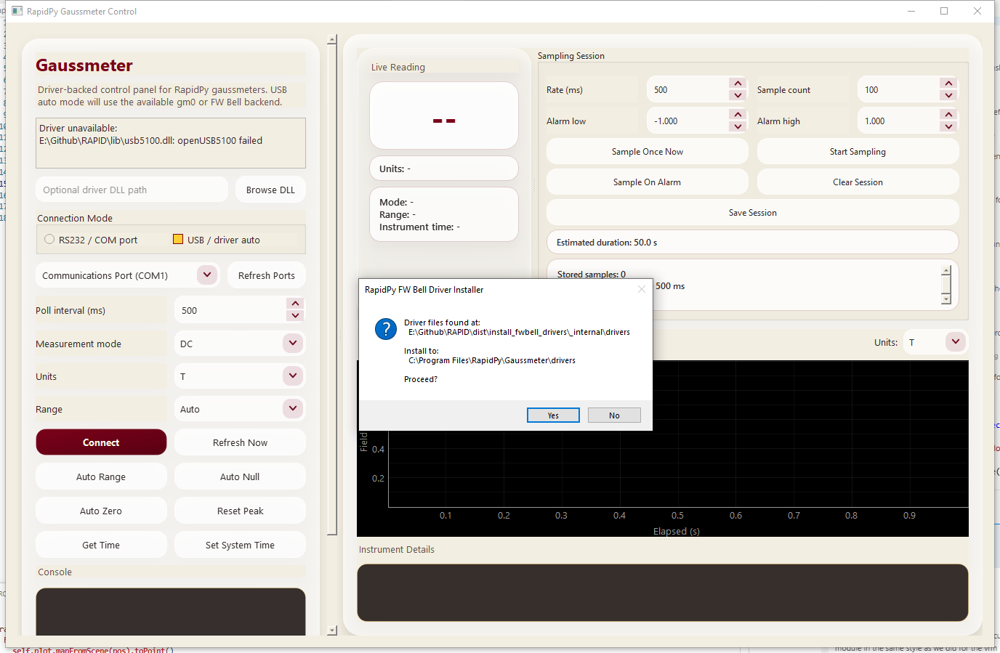
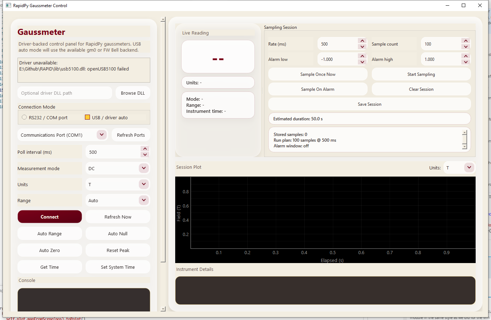

# RapidPy Gaussmeter Control — User Manual

This manual covers the complete workflow for installing the FW Bell USB gaussmeter driver stack and operating the **RapidPy Gaussmeter Control** application.

---

## Table of Contents

1. [System Requirements](#1-system-requirements)
2. [What Gets Installed](#2-what-gets-installed)
3. [Installation — From the Setup Installer](#3-installation--from-the-setup-installer)
4. [Installation — Manual / Developer Path](#4-installation--manual--developer-path)
5. [FW Bell Driver Installer](#5-fw-bell-driver-installer)
6. [Launching the App](#6-launching-the-app)
7. [Application Overview](#7-application-overview)
8. [Left Panel — Connection & Controls](#8-left-panel--connection--controls)
9. [Right Panel — Live Reading & Sampling Session](#9-right-panel--live-reading--sampling-session)
10. [Session Plot](#10-session-plot)
11. [Instrument Details](#11-instrument-details)
12. [Sampling Workflows](#12-sampling-workflows)
13. [Saving Session Data](#13-saving-session-data)
14. [Troubleshooting](#14-troubleshooting)

---

## 1. System Requirements

| Item | Requirement |
|---|---|
| OS | Windows 10 / 11 (64-bit) |
| Instrument | FW Bell 5100 / 5180 USB gaussmeter |
| USB | One free USB-A port |
| Driver | `usb5100.dll` + `libusb0.dll` (from FW Bell PC5180 software) |
| Python (dev path only) | 3.10+ with `paleomag` conda environment |

---

## 2. What Gets Installed

The full package consists of:

```
RapidPy\Gaussmeter\
├── RapidPy_Gaussmeter.exe          ← main application
├── _internal\                      ← PyInstaller bundle (DLLs, .pyd, etc.)
│   └── tools\
│       ├── usb5100_probe.exe       ← x86 helper called at runtime
│       ├── usb5100.dll             ← FW Bell vendor DLL
│       └── libusb0.dll             ← libusb-win32 shim
└── driver_installer\
    └── install_fwbell_drivers.exe  ← standalone driver installer
```

The `usb5100_probe.exe` helper is a small 32-bit executable that loads `usb5100.dll` (which is 32-bit only) and relays readings back to the 64-bit Python host via stdout. Python never loads the DLL directly.

---

## 3. Installation — From the Setup Installer

> **If you received a `RapidPy_Gaussmeter_Setup_x.x.x.exe` file**, this is the simplest path.

1. Double-click `RapidPy_Gaussmeter_Setup_x.x.x.exe`.
2. Follow the Inno Setup wizard:
   - Accept the licence.
   - Choose an install folder (default: `C:\Program Files\RapidPy\Gaussmeter`).
   - On the **Additional Tasks** page, check **Install FW Bell USB driver files** if you want the DLLs installed automatically. This requires that `usb5100.dll` and `libusb0.dll` are bundled inside the installer or detectable from an existing FW Bell PC5180 installation.
3. Click **Install**.
4. The driver installer runs silently in the background if the task is checked.
5. After setup completes, optionally launch the app from the **Finish** page.

The installer creates Start Menu shortcuts for both the main app and the driver installer (in case you need to re-run it later).

---

## 4. Installation — Manual / Developer Path

Use this path when running from source code or when rebuilding the bundle.

### 4a. Prerequisites

```powershell
# Create and activate the conda environment
conda env create -f environment.yml
conda activate paleomag
```

### 4b. Copy vendor DLLs

The FW Bell DLLs are **not** bundled in the repository. Copy them from the FW Bell PC5180 software into `lib\`:

```
lib\
├── usb5100.dll
└── libusb0.dll
```

Typical source location from the FW Bell installer: `C:\Program Files (x86)\FW Bell\PC5180\`

### 4c. Build the PyInstaller bundle

```powershell
# From the repo root — builds both the app and the driver installer, then
# compiles the Inno Setup installer script into a single .exe
.\installer\build_installer.ps1
```

Parameters:

| Parameter | Default | Description |
|---|---|---|
| `-CondaEnv` | `paleomag` | Conda environment to run PyInstaller in |
| `-InnoSetupPath` | `C:\Program Files (x86)\Inno Setup 6\ISCC.exe` | Path to Inno Setup compiler |
| `-SkipPyInstaller` | (off) | Skip the PyInstaller step; re-use existing `dist\` output |
| `-SkipInnoSetup` | (off) | Produce the PyInstaller bundle but skip the `.exe` packaging |

Inno Setup 6 must be installed separately: <https://jrsoftware.org/isinfo.php>

### 4d. Run from source (no build)

```powershell
conda activate paleomag
cd RapidPy\gaussmeter_control
python main.py
```

When running from source the app expects to find `usb5100.dll` either:
- Next to `main.py`, or
- In a `lib\` sibling two levels up (auto-detected), or
- Via the **Browse DLL** button in the UI.

---

## 5. FW Bell Driver Installer

The driver installer is a standalone executable that copies `usb5100.dll` and `libusb0.dll` to the system driver directory used by the main app.



*The installer auto-detects the DLLs from known locations (bundled `drivers\` folder, or existing FW Bell PC5180 installation) and shows a confirmation before copying.*

### How it works

1. On launch, the installer searches these locations for the required DLLs:
   - A `drivers\` subfolder bundled alongside the exe (inside the PyInstaller `_internal\`).
   - `C:\Program Files (x86)\FW Bell\PC5180\`
   - `C:\Program Files\FW Bell\PC5180\`
   - `C:\FWBell\PC5180\`
2. If auto-detection fails, a folder browser opens so you can point to the DLLs manually.
3. The DLLs are copied to:  
   `C:\Program Files\RapidPy\Gaussmeter\drivers\`
4. That directory is added to the **system `PATH`** (requires Administrator) so `usb5100_probe.exe` can find them at runtime.

### Silent mode

The installer can also be run non-interactively during scripted deployment:

```
install_fwbell_drivers.exe --silent
```

Returns exit code `0` on success, `1` on failure.

### Administrator requirement

Writing to `Program Files` requires elevation. The installer requests a UAC prompt automatically if it is not already running as Administrator.

---

## 6. Launching the App

- **From the installed bundle:** Start Menu → RapidPy → RapidPy Gaussmeter, or double-click `RapidPy_Gaussmeter.exe`.
- **From source:** `conda activate paleomag && python RapidPy\gaussmeter_control\main.py`

The app does not require the gaussmeter to be plugged in before launch.

---

## 7. Application Overview



*Main window at startup. Left panel: connection controls and console. Upper-right: live reading and sampling session. Lower-right: session plot and instrument details.*

The window is split into two resizable panels separated by a draggable splitter handle:

| Panel | Purpose |
|---|---|
| **Left** | Connection setup, measurement settings, command buttons, console log |
| **Right** | Live reading display, sampling session controls, session plot, instrument details |

---

## 8. Left Panel — Connection & Controls

### Driver Status box

Displayed at the top of the left panel. Reports whether the required DLL was found and what version/path was detected:

- **"Driver ready (Auto-detected)"** — the app found `usb5100.dll` automatically. Ready to connect.
- **"Driver ready (User-specified)"** — a DLL was manually browsed to. Ready to connect.
- **"Driver unavailable"** — DLL not found. The **Connect** button is disabled. Install the driver or use Browse DLL.

### Browse DLL

Opens a file picker to locate `usb5100.dll` directly. Use this when the DLL exists somewhere non-standard (e.g. on a network share or a removable drive). The choice persists until the path is cleared or the app is restarted.

### Connection Mode

| Option | When to use |
|---|---|
| **USB / driver auto** | FW Bell 5100/5180 connected over USB. The app communicates through the `usb5100_probe.exe` helper and the vendor DLL. No COM port selection needed. |
| **RS232 / COM port** | Legacy Hirst-style gaussmeter or any RS-232 device. Select the COM port from the dropdown. |

### COM Port / Refresh Ports

Only active in **RS232** mode. Shows all currently enumerated serial ports. Click **Refresh Ports** to re-scan after plugging in a USB-serial adapter.

### Poll interval (ms)

How often the app requests a new reading from the instrument while connected (default: 500 ms). Minimum: 100 ms. Increasing this reduces USB traffic for long-running sessions.

### Measurement mode

Selects the FW Bell operating mode sent to the instrument on connect:

| Label | SCPI mode | Description |
|---|---|---|
| DC | 0 | DC field measurement |
| AC | 1 | AC RMS field measurement |
| AC Peak | 2 | AC peak-hold field measurement |
| AC Peak-to-Peak | 3 | AC peak-to-peak field measurement |

### Units

Sets the measurement units reported by the instrument. Options depend on the instrument firmware but typically include: `T`, `mT`, `G`, `kG`, `A/m`, `kA/m`, `Oe`.

### Range

| Option | Behaviour |
|---|---|
| **Auto** | Instrument selects the best range automatically |
| Range 0–3 | Fixed hardware range (lower range number = higher sensitivity) |

### Connect / Disconnect

- **Connect** — opens the instrument connection, pushes the current mode/units/range settings, starts the poll timer, and immediately reads one value.
- **Disconnect** — stops polling, closes the connection, and clears the live reading display.

### Refresh Now

Reads one value immediately (without waiting for the next poll timer tick). Useful when you want to check the current reading after changing a setting.

### Instrument command buttons

| Button | What it does |
|---|---|
| **Auto Range** | Sends the auto-range command and sets the Range dropdown to Auto |
| **Auto Null** | Runs the instrument's built-in autonull (zero-field compensation) |
| **Auto Zero** | Sends the autozero command (DC offset removal) |
| **Reset Peak** | Clears the instrument's peak-hold register |
| **Get Time** | Reads the instrument's internal RTC and logs it to the console |
| **Set System Time** | Writes the current PC system time to the instrument's RTC |

All command buttons are disabled when disconnected.

### Console

A scrollable terminal-style log that records:
- Connection events (connected, disconnected, driver path)
- Results of command buttons (e.g. "Auto null complete")
- Error messages
- Sampling session events

---

## 9. Right Panel — Live Reading & Sampling Session

### Live Reading

Displays the most recent measurement value in a large numeric font. Updates at the poll interval. Shows `--` when disconnected or when no reading has been received yet.

Below the main number:
- **Units** — the unit string reported by the instrument (e.g. "Units: G (base G)").
- **Mode / Range / Instrument time** — current instrument state from the last reading.

### Sampling Session

Collects a series of discrete field measurements, optionally timed or alarm-triggered, into an in-memory session that can be plotted and exported to CSV.

| Control | Description |
|---|---|
| **Rate (ms)** | How many milliseconds between each captured sample (50–60,000 ms) |
| **Sample count** | How many samples to collect in one timed run |
| **Alarm low / Alarm high** | Numeric bounds for alarm-based capture (see below) |
| **Sample Once Now** | Captures a single sample from the current reading immediately |
| **Start Sampling / Stop Sampling** | Starts or stops a timed sampling run |
| **Sample On Alarm / Turn Alarm Off** | Toggles alarm-window filtering (see below) |
| **Clear Session** | Deletes all stored samples and resets the plot |
| **Save Session** | Exports all stored samples to a CSV file |
| **Estimated duration** | Computed preview: `Rate × Sample count` |
| **Session status** | Live text summary: stored count, run plan, alarm state, run progress |

#### Timed sampling run

1. Set **Rate (ms)** and **Sample count**.
2. Click **Start Sampling**.
3. The app fires a timer at the requested rate and captures one reading per tick.
4. Sampling stops automatically when the target count is reached, or when you click **Stop Sampling**.

#### Alarm-window sampling

When **Sample On Alarm** is active, a sample is only recorded if the field value falls within the `[Alarm low, Alarm high]` window. Samples outside this window are discarded. This is useful for capturing events (e.g. field excursions or quiet windows) without filling the session with steady-state data.

Alarm-window filtering works alongside the timed run: sampling still fires at the configured rate but only records hits.

---

## 10. Session Plot

Shows the captured samples as a scatter+line trace on a **Elapsed (s)** vs. **Field** plot.

- **Units selector** (top-right of plot): Changes the y-axis unit. All stored samples are converted on-the-fly:
  - T, mT, G, kG, A/m, Oe
- **Hover crosshair**: Move the mouse over the plot to see a crosshair snap to the nearest sample and a tooltip showing sample index, elapsed time, and field value.
- **Pan / Zoom**: Right-click and drag to pan; scroll wheel to zoom; right-click for the pyqtgraph context menu (including Export).

---

## 11. Instrument Details

A plain-text readout below the session plot showing the raw field values from the most recent poll:

```
Displayed value: 0.001234
Raw value: 1234
Mode index: 0
Units index: 2
Range index: 4
Driver: C:\Program Files\RapidPy\Gaussmeter\drivers\usb5100.dll
```

Useful for debugging unit conversions or verifying that the instrument is responding correctly.

---

## 12. Sampling Workflows

### Workflow A — Spot check

1. Connect (USB auto mode).
2. Watch the **Live Reading** for the field at your measurement point.
3. Click **Sample Once Now** to record that value.
4. Repeat for each measurement point.
5. **Save Session** when done.

### Workflow B — Timed field log

1. Set **Rate (ms)** = 1000, **Sample count** = 300 (= 5-minute log).
2. Position probe.
3. Click **Start Sampling** — the app collects one reading per second for 300 seconds.
4. **Save Session** to CSV.

### Workflow C — Alarm-triggered capture

*Example: capture only readings below a threshold (quiet-field windows).*

1. Set **Alarm low** = -0.005, **Alarm high** = 0.005 (±5 mT in Gauss mode).
2. Click **Sample On Alarm** to arm it.
3. Start a long timed run (**Rate** = 500 ms, **Sample count** = 10000).
4. Only readings within ±5 mT are stored; ambient noise outside the window is discarded.

---

## 13. Saving Session Data

Click **Save Session**. A file-save dialog opens with a default name of the form:

```
gaussmeter-session-YYYYMMDD-HHMMSS.csv
```

The CSV contains one row per captured sample with these columns:

| Column | Content |
|---|---|
| `index` | Sample sequence number (1-based) |
| `elapsed_s` | Seconds since the first sample of the session |
| `captured_at` | ISO 8601 timestamp of when the sample was taken |
| `value` | Displayed field value (in the instrument's reported units) |
| `raw_value` | Raw integer from the instrument before unit conversion |
| `units_label` | Unit string (e.g. "G") |
| `base_units_label` | Base unit (e.g. "G") |
| `mode_index` | Numeric mode index |
| `mode_label` | Human-readable mode name (e.g. "DC") |
| `units_index` | Numeric units index |
| `range_index` | Hardware range index |
| `driver_path` | Full path to the DLL used for this sample |

---

## 14. Troubleshooting

### "Driver unavailable: openUSB5100 failed"

The app found `usb5100.dll` but the DLL itself could not open the USB device. Possible causes:

- **Instrument not plugged in or not powered.** Plug in the FW Bell gaussmeter and power it on.
- **`libusb0.dll` not in the same directory as `usb5100.dll`.** Both DLLs must be co-located. Re-run the driver installer.
- **USB driver not bound.** The instrument needs a `libusb-win32` kernel driver bound to it in Device Manager. This is a one-time setup step:
  1. Install **Zadig** (included in `tools\zadig.exe`).
  2. In Zadig: select the FW Bell device → Driver = libusb-win32 → **Replace Driver**.
  3. Reboot if prompted.

### Connect button is greyed out

The driver status box shows "Driver unavailable". The app disables **Connect** when no working DLL is found. Fix the driver situation first (see above).

### "openUSB5100 failed" after the driver was previously working

The USB kernel driver binding can be lost after a Windows Update. Re-run Zadig to rebind `libusb-win32` to the FW Bell device.

### RS-232 mode: cannot connect

- Verify the correct COM port is selected (use Device Manager or the **Refresh Ports** button).
- The instrument communicates at **9600 baud, 8N1** (or per the instrument spec). Check cable wiring.

### Live Reading shows "−−" even after connecting

Click **Refresh Now**. If it still shows `--`, check the console for error messages. The instrument may have returned an unparseable response.

### Session plot is empty

A sampling session must be running (or **Sample Once Now** must have been clicked at least once) before data appears in the plot. Simply connecting does not add points to the session.
