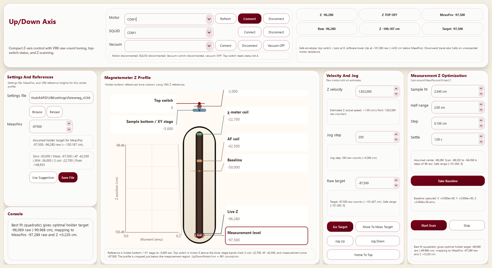
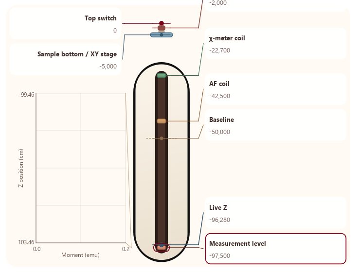
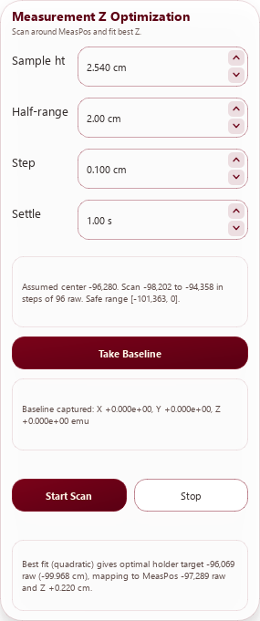

# RapidPy Up/Down Control — User Manual

RapidPy Up/Down Control is the current Python operator panel for the RAPID Z axis. It keeps the VB6 raw-count motion model for the up/down motor, but makes the state much easier to read by combining motor, SQUID, vacuum, profile references, and measurement-Z optimization in one window.



The app is primarily the Python replacement for the Z-axis slice of the legacy motion workflow, with the closest references in:

- `VB6/frmDCMotors.frm` for homing, direct motion, pickup/dropoff positions, and MeasPos-centered travel logic
- `VB6/frmVacuum.frm` for vacuum serial commands and valve/motor-power toggling
- `VB6/frmMagnetometerControl.frm` for the expectation that vacuum support remains part of magnetometer-side operator workflow

---

## Table of Contents

1. [Purpose](#1-purpose)
2. [Launch And Build](#2-launch-and-build)
3. [Window Overview](#3-window-overview)
4. [Connections And Hardware Roles](#4-connections-and-hardware-roles)
5. [Settings File And Reference Positions](#5-settings-file-and-reference-positions)
6. [Magnetometer Z Profile](#6-magnetometer-z-profile)
7. [Velocity, Jog, And Preset Motion](#7-velocity-jog-and-preset-motion)
8. [Vacuum Control](#8-vacuum-control)
9. [Measurement Z Optimization Workflow](#9-measurement-z-optimization-workflow)
10. [Safety Model](#10-safety-model)
11. [Files Written By The App](#11-files-written-by-the-app)
12. [VB6 Transition Sheet](#12-vb6-transition-sheet)
13. [Troubleshooting](#13-troubleshooting)

---

## 1. Purpose

This app is meant for day-to-day Z-axis operation around the magnetometer bore. It focuses on:

- connecting the up/down motor, SQUID serial line, and vacuum serial line
- exposing live Z position and top-switch status in the header
- keeping VB6-compatible raw velocity and raw position controls
- showing the measurement region, AF coil, susceptibility coil, and holder geometry in a single profile view
- scanning a user-chosen Z region around `MeasPos`, fitting the strongest absolute moment, and suggesting an updated measurement position
- saving the updated `MeasPos` back to a VB6-compatible settings file or the newer section-based JSON settings format

The Python app is intentionally narrower than the full VB6 MDI shell. It concentrates on the operator tasks that directly affect safe Z motion and reliable measurement-height setup.

---

## 2. Launch And Build

### Launch From Source

From the repository root:

```powershell
conda activate paleomag
python RapidPy/updown_control/main.py
```

### Windows Build

From the repository root:

```powershell
cd RapidPy\updown_control
build_windows.bat
```

The current Windows build script now prefers the repository virtual environment automatically when a repo-root `.venv\Scripts\python.exe` exists.
The compiled bundle is written to the repository root:

```text
dist/RapidPyUpDown.exe
```

### Default Startup Inputs

On startup, the app loads:

- machine-local app state from `~/.rapidpy_updown_settings.json`
- Z-axis hardware/reference values from `VB6/settings/Paleomag_v3.INI` unless a different settings file was selected previously

---

## 3. Window Overview

The window is organized into four operator zones.

- Header: motor, SQUID, and vacuum connections; live Z pills; top-switch state; current MeasPos; safety banner
- Left column: settings file path, `MeasPos`, saved reference values, console output
- Center panel: magnetometer Z profile with clickable targets and embedded scan plot
- Right column: manual motion controls plus the measurement-Z optimization workflow

This layout intentionally separates three different ideas that were more blended together in VB6:

- immediate device connectivity
- Z-axis motion and reference geometry
- scan-and-fit measurement optimization

---

## 4. Connections And Hardware Roles

The app exposes three hardware roles separately so faults are easier to diagnose.

### Motor

- Connects to the Quicksilver-based up/down axis over serial
- Used for homing, jog moves, preset moves, and scan moves
- Top-switch state is polled live and shown in the header as `Z TOP ON` or `Z TOP OFF`

### SQUID

- Connects to the raw serial SQUID interface
- Used for baseline capture and the point-by-point moment readings during Z optimization scans
- The scan result uses the maximum absolute moment magnitude, not only the most positive value

### Vacuum

- Connects to the vacuum controller on its own serial port
- Has separate `Connect` / `Disconnect` actions and a latched `Vacuum ON` / `Vacuum OFF` toggle
- Status text in the header reports both communication state and vacuum enabled state

The app keeps COM assignments in the machine-local settings file rather than overwriting them from the shared INI. That matches the practical reality that port mapping is workstation-specific while motion/reference data belongs to the machine settings profile.

---

## 5. Settings File And Reference Positions

The `Settings And References` card is the anchor for the Z reference system.

It includes:

- the currently loaded settings path
- `Browse` and `Reload` actions
- the editable `MeasPos` value
- the implied holder target corresponding to the current `MeasPos` and sample height
- a compact list of the major VB6 reference positions: `Zero`, `Meas`, `AF`, `IRM`, `S coil`, and `Floor`
- `Use Suggestion` and `Save File` actions

### Supported File Formats

The app can load either:

- VB6-style `.ini`
- section-based `.json`

When you save, the app preserves the source format. If you save to `.json`, it writes the JSON section layout. If you save to `.ini`, it writes an INI.

### What Save File Actually Changes

The app currently edits the `SteppingMotor.MeasPos` value and then rebuilds the active settings profile from the saved file.
That is deliberate: the scan workflow is meant to refine the measurement position without silently rewriting unrelated machine values.

### Snapshot History

Before overwriting an existing settings file, the app creates a backup snapshot under:

```text
<settings-folder>/.rapidpy_history/<settings-stem>/
```

This gives operators a fast rollback path if a newly accepted `MeasPos` needs to be reverted.

---

## 6. Magnetometer Z Profile

The center panel translates raw Z reference values into an operator-readable profile of the bore region.



The profile includes:

- top switch at motor zero
- sample bottom / XY stage reference
- baseline / zero reference
- susceptibility coil band
- AF coil band
- measurement-level band
- live Z marker when the motor is connected or a synthetic reference is being displayed
- embedded scan plot for measurement-Z optimization

### Interaction Model

The profile uses the same interaction pattern already adopted in the Python changer app:

- single-click a label or symbol to select that target
- double-click a label or symbol to move the Z axis to that raw position

That means the profile is not only explanatory; it is also a motion selector.

### Why The Plot Lives Inside The Profile

The scan plot is drawn inside the profile card so the operator can see the measured moment values and the physical Z references together. The fitted suggestion is easier to judge when the measurement band, sample bottom, and suggested target all share the same visual reference space.

---

## 7. Velocity, Jog, And Preset Motion

The `Velocity And Jog` card is the direct replacement for the everyday VB6 motion controls.

It includes:

- `Z velocity` in VB6-compatible raw controller units
- a live estimated cm/s helper text derived from the loaded `UpDownMotor1cm` and turning-motor scale
- `Jog step` in raw counts with cm translation
- direct raw target entry
- `Go Target`
- `Move To Meas Target`
- `Jog Up` and `Jog Down`
- `Home To Top`
- editable raw preset positions for `Pickup`, `Dropoff`, and `Susc. Meter`

### Velocity Clarification

The numeric velocity field is not direct cm/s. The app converts the raw controller value into estimated physical speed using the loaded turning-motor scale and `UpDownMotor1cm`, then shows the translated estimate directly below the control.

This is the same design decision already used in the Python changer app: keep VB6-compatible raw values for hardware parity, but stop making operators mentally translate them.

### Direct Motion Versus Measurement Motion

- `Go Target` moves to the raw target value shown in the card
- `Move To Meas Target` calculates the holder target implied by the current `MeasPos` and sample height
- `Home To Top` runs the top-switch homing action

The `Move To Meas Target` button is the practical bridge between saved `MeasPos` and the real holder target inside the bore.

---

## 8. Vacuum Control

Vacuum controls now live in the header beside the motor and SQUID connections so all live machine connectivity sits in one place.

The current Python controller follows the same command sequence found in the VB6 vacuum forms.

### Command Pattern

The implementation uses the VB6-style serial commands for:

- reset: `10R00`, then `10TFF`
- motor power enable/disable: `E` / `D` and `10MFF` / `10M00`
- valve connect/disconnect: `O` / `C` and `10VFF` / `10V00`

That behavior mirrors the older forms closely while making the state explicit with a single checkable `Vacuum ON` button.

---

## 9. Measurement Z Optimization Workflow

The `Measurement Z Optimization` card is the most important workflow improvement over the older manual tuning style.



### Default Workflow

1. Load the correct settings file so `MeasPos` and `UpDownMotor1cm` are valid.
2. Connect the motor and SQUID.
3. Set `Sample ht`, `Half-range`, `Step`, and `Settle`.
4. Click `Take Baseline`.
5. Click `Start Scan`.
6. Review the fitted result in the result box and the embedded profile plot.
7. Click `Use Suggestion` if the fit looks reasonable.
8. Click `Save File` to write the new `MeasPos` into the settings file.

### Current Defaults

- sample height: `2.540 cm`
- half-range: `2.00 cm`
- step: `0.100 cm`
- settle: `1.00 s`

These defaults were chosen so the scan is immediately usable for a 1-inch sample and does not inherit the overly fine older persisted values.

### What The Scan Actually Does

For each scan point, the app:

- converts the requested cm position into raw motor counts
- moves the Z axis to that raw target
- waits for the configured settle time
- reads SQUID X/Y/Z values
- converts them through the loaded calibration
- computes total moment magnitude
- updates the inset plot immediately

After all points are collected, the app fits the best measurement Z using the maximum absolute moment magnitude. The result text reports:

- optimal holder target in raw counts
- the same target in centimeters when available
- the mapped suggested `MeasPos` raw count
- the fitted Z offset in cm

This reduces the amount of manual arithmetic the VB6 operator had to do when refining the stored measurement height.

---

## 10. Safety Model

The Python app intentionally keeps the safety model visible.

The header warning text always explains the current envelope in plain language.

### Current Protections

- top reference at the switch / raw zero region
- MeasPos-relative software lower clip
- scan-window clipping against the same safe range
- stop-and-warn behavior when a commanded move stops short of the requested target

### Why This Is Slightly Different From VB6

The VB6 workflow effectively treated unexpected stopping or resistance as an operator-facing fault condition and shut down drive behavior with a warning. The Python app preserves that operator outcome, but the shared Python motor wrapper does not currently expose a dedicated motor-resistance or load flag.

Because of that, the current implementation uses two concrete protections instead:

- a shorter MeasPos-relative software lower bound rather than the old oversized `1.15 x |MeasPos|` envelope
- a stopped-short detection path that halts the axis, latches a red warning state, and tells the operator to inspect clearance before continuing

So the protective behavior is retained even though the exact underlying signal path is not yet identical to VB6.

---

## 11. Files Written By The App

The app writes three kinds of state.

- machine-local app settings: `~/.rapidpy_updown_settings.json`
- snapshots of overwritten settings files: `.rapidpy_history/<settings-stem>/`
- the saved `.ini` or `.json` settings file chosen in the settings card

The local JSON stores items such as preferred COM ports, jog defaults, scan defaults, and the last selected settings path.

---

## 12. VB6 Transition Sheet

| Operator task | Legacy VB6 reference | Python app control |
| --- | --- | --- |
| Home the Z axis | `frmDCMotors.frm` `HomeToTop` | `Home To Top` |
| Move to an arbitrary Z target | `frmDCMotors.frm` `MoveMotor` / `UpDownMove` | `Go Target` |
| Move to the measurement position | `MeasPos` logic in `frmDCMotors.frm` | `Move To Meas Target` |
| Move to pickup/dropoff/susceptibility positions | `SamplePickup`, `SampleDropOff`, `SCoilPos`-based motion | `Pickup`, `Dropoff`, `Susc. Meter` |
| Observe top switch and live Z status | motor status polling in `frmDCMotors.frm` | header pills and profile live marker |
| Vacuum reset and on/off control | `frmVacuum.frm` and `frmMagnetometerControl.frm` | header vacuum `Connect`, `Disconnect`, and `Vacuum ON/OFF` |
| Refine `MeasPos` after a measurement scan | manual operator tuning around stored `MeasPos` | `Measurement Z Optimization`, `Use Suggestion`, `Save File` |

This sheet is the quickest way to orient an experienced VB6 user: the names are cleaner in Python, but the underlying machine references are intentionally familiar.

---

## 13. Troubleshooting

### The safe range looks smaller than expected

- this is intentional
- the lower envelope is now tied to `MeasPos` and the current scan/sample context rather than the older oversized rule
- if a target or scan window is clipped, check whether `MeasPos`, sample height, or half-range is set incorrectly

### A downward move stops early and the warning turns red

- treat that as a real clearance or resistance event
- inspect the holder and bore before retrying
- the app will not silently ignore a stopped-short move

### The scan buttons are enabled but the scan will not start

- the motor must be connected
- the SQUID must be connected
- a baseline must be taken first
- `UpDownMotor1cm` must be present in the loaded settings profile

### The estimated cm/s looks wrong

- the raw velocity box is still in VB6-compatible controller units
- verify the loaded settings file has the expected turning-motor values and `UpDownMotor1cm`
- the helper text below the velocity box is the physical estimate to trust

### Saving settings changed the file but not the machine behavior

- reload the settings file if you switched files externally
- verify the intended file path in the settings card
- remember that COM port choices are stored locally and are not imported from the shared INI
