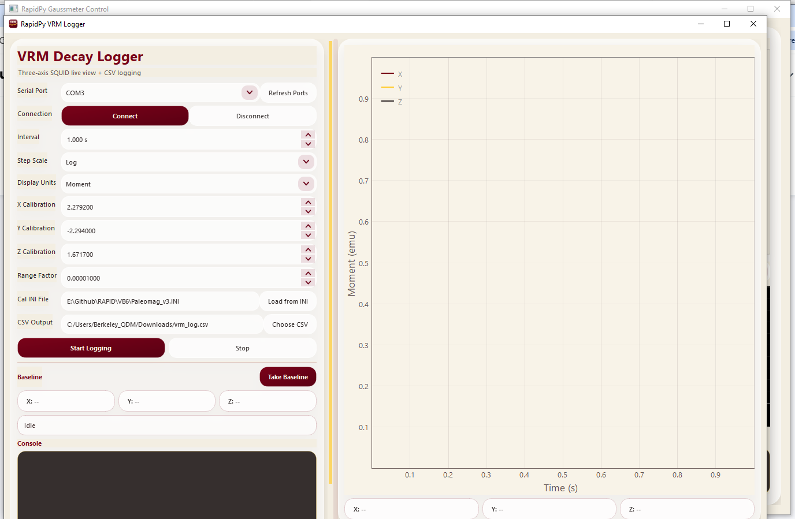

# RapidPy VRM Decay Logger — User Manual

This manual covers the complete workflow for operating the **RapidPy VRM Decay Logger** — a three-axis SQUID magnetometer logger that records viscous remanent magnetization (VRM) decay experiments.

---

## Table of Contents

1. [What Is VRM Logging](#1-what-is-vrm-logging)
2. [System Requirements](#2-system-requirements)
3. [Launching the App](#3-launching-the-app)
4. [Application Overview](#4-application-overview)
5. [Left Panel — Controls](#5-left-panel--controls)
   - [Serial Port](#serial-port)
   - [Connection](#connection)
   - [Interval & Step Scale](#interval--step-scale)
   - [Display Units](#display-units)
   - [Calibration](#calibration)
   - [Range Factor](#range-factor)
   - [Cal INI File](#cal-ini-file)
   - [CSV Output](#csv-output)
   - [Start Logging / Stop](#start-logging--stop)
   - [Baseline Section](#baseline-section)
   - [Status Label](#status-label)
   - [Console](#console)
6. [Right Panel — Live Plot](#6-right-panel--live-plot)
   - [Dual Time Axes](#dual-time-axes)
   - [Three-Axis Traces](#three-axis-traces)
   - [Hover Tooltip](#hover-tooltip)
   - [Value Readouts](#value-readouts)
7. [Complete Measurement Workflow](#7-complete-measurement-workflow)
8. [CSV Output Format](#8-csv-output-format)
9. [Calibration Details](#9-calibration-details)
10. [Configuration Persistence](#10-configuration-persistence)
11. [Building the App from Source](#11-building-the-app-from-source)
12. [Troubleshooting](#12-troubleshooting)

---

## 1. What Is VRM Logging

Viscous remanent magnetization (VRM) is a time-dependent remanence acquired when a sample is exposed to an ambient magnetic field over time. Measuring its decay after field removal requires continuous three-axis SQUID magnetometer readings over minutes to hours.

The RapidPy VRM Logger:
- Reads X, Y, Z voltages from a SQUID magnetometer over a 1200-baud RS-232 serial connection.
- Subtracts a user-taken baseline reading (the "background" field) in raw volts before conversion, so that plotted values represent change from the moment logging began.
- Converts raw voltages to magnetic moment (emu) using axis-specific calibration constants loaded from the lab's `Paleomag_v3.INI` file.
- Plots all three axes in real time with a dual time-axis display (elapsed seconds at bottom, wall-clock datetime at top).
- Logs every reading to a CSV file for later analysis.

---

## 2. System Requirements

| Item | Requirement |
|---|---|
| OS | Windows 10 / 11 (or macOS — see `build_macos.sh`) |
| SQUID interface | RS-232 serial; 1200 baud, 8 data bits, no parity, 1 stop bit |
| USB-serial adapter | Required if the PC has no native RS-232 (FTDI or Prolific adapters are typical) |
| Python (dev path) | 3.10+ with `paleomag` conda environment |

The instrument used is a 2G Enterprises three-axis SQUID magnetometer with an RS-232 interface.

---

## 3. Launching the App

**From the conda environment (source):**
```powershell
conda activate paleomag
cd RapidPy\vrm_logger
python main.py
```

**From a built executable (if available):**  
Double-click `RapidPy_VRM_Logger.exe` in the application folder.

The app opens with the last-used settings restored. The INI calibration is auto-applied on first launch if `VB6\Paleomag_v3.INI` is found in the repository tree.

---

## 4. Application Overview



*Main window at startup. Left panel: all controls, calibration, baseline, console. Right panel: live three-axis plot with dual time axes and real-time value readouts at the bottom.*

The window uses a **resizable horizontal splitter** — drag the handle between the panels to give more space to the plot or the controls. The left panel scrolls vertically if the window is too short to show everything at once.

---

## 5. Left Panel — Controls

### Serial Port

A dropdown listing all currently enumerated COM ports on the system. The last-used port is pre-selected on startup.

**Refresh Ports** — re-scans COM ports without restarting the app. Use this after plugging in a USB-serial adapter.

---

### Connection

| Button | Action |
|---|---|
| **Connect** | Opens the selected COM port at 1200 baud, 8N1. On success, the status label updates and the baseline workflow becomes available. |
| **Disconnect** | Closes the serial port. Clears any stored baseline. Disabling **Start Logging** until a new baseline is taken after reconnection. |

> You must be connected before you can take a baseline or start logging.

---

### Interval & Step Scale

**Interval** — the time between SQUID readings in seconds (range: 0.05 s to 3600 s). The worker thread sleeps for this duration between acquisitions.

**Step Scale** — controls how the inter-sample wait time evolves:

| Option | Behaviour |
|---|---|
| **Linear** | Every sample uses the same fixed interval. Uniform time-series. |
| **Log** | Each interval multiplies the previous one by the base interval. This gives dense early sampling followed by increasingly sparse measurements — ideal for VRM decay which is fastest immediately after field removal. |

> **Recommended for VRM:** use Log scale with a short base interval (e.g. 1 s). The first sample arrives at 1 s, the next at ~2.7 s, then ~7.4 s, and so on, giving excellent time resolution in the fast-decay early portion.

---

### Display Units

Selects what unit the plot Y-axis and value readouts use:

| Option | Description |
|---|---|
| **Moment** | Converts raw SQUID voltages to magnetic moment in **emu** using the calibration constants and range factor (see [Calibration Details](#9-calibration-details)). |
| **Volts** | Displays the raw SQUID voltages (after baseline subtraction). No calibration applied. |

Switching units while a session is active immediately re-labels the Y-axis and updates the baseline readouts.

---

### Calibration

Three spin-boxes for the per-axis calibration factors:

| Field | Typical value | Description |
|---|---|---|
| **X Calibration** | 2.2792 | SQUID X-axis calibration constant (V → emu conversion, pre-range-factor) |
| **Y Calibration** | −2.294 | SQUID Y-axis calibration constant |
| **Z Calibration** | 1.6717 | SQUID Z-axis calibration constant |

The formula applied for each axis:

$$\text{moment (emu)} = (V_{\text{raw}} - V_{\text{baseline}}) \times \text{Cal} \times \text{RangeFact}$$

Where $V_{\text{raw}}$ is the measured SQUID voltage and $V_{\text{baseline}}$ is the voltage stored when **Take Baseline** was clicked.

> Calibration constants are loaded automatically from `Paleomag_v3.INI`. You can override them manually if needed.

---

### Range Factor

A high-precision spin-box for the `RangeFact` scalar (default: `0.00001` = 1×10⁻⁵).

This factor converts the product of (voltage × calibration constant) into physical emu. It corresponds to the `RangeFact` key in the `[MagnetometerCalibration]` section of `Paleomag_v3.INI` and matches the value used in the original VB6 RAPID software.

---

### Cal INI File

Displays the path to the calibration INI file. On first launch the app searches up to five parent directories for `VB6\Paleomag_v3.INI` and loads it automatically.

**Load from INI** — if the path is already valid, clicking this button re-reads it and updates the X/Y/Z Calibration and Range Factor spinboxes. If the path field is empty or points to a missing file, a file picker opens first.

The INI section read is:
```ini
[MagnetometerCalibration]
XCal=2.2792
YCal=-2.294
ZCal=1.6717
RangeFact=0.00001
```

---

### CSV Output

A text field showing the path to the output CSV file. Click **Choose CSV** to browse or type a path directly.

The folder is created automatically if it does not exist when logging starts.

---

### Start Logging / Stop

**Start Logging** is enabled only after a baseline has been taken (see below). Clicking it:

1. Checks that the COM port is connected.
2. If the CSV file already exists and is non-empty, shows a dialog with three options:
   - **Append** — adds new rows to the existing file, no header written.
   - **Overwrite** — truncates the file and writes a fresh header.
   - **Choose New Name** — opens a file-save dialog.
   - **Cancel** — aborts.
3. Writes the CSV header row.
4. Records `session_start` as the wall-clock time (Unix epoch).
5. Sets the top-axis reference on the plot so it shows real datetimes.
6. Starts the background acquisition worker thread.
7. Disables **Take Baseline** for the duration of the session.

**Stop** — signals the worker thread to stop. When it finishes:
- The CSV file is closed and flushed.
- The baseline is cleared (the baseline readouts reset to `--`).
- **Take Baseline** is re-enabled.
- **Start Logging** is disabled until a new baseline is taken.

> This "baseline required" design ensures that every logging run starts from a known reference state and prevents accidental logging without subtraction.

---

### Baseline Section

The baseline workflow is the most important pre-measurement step.


**Take Baseline** — takes a single synchronous SQUID reading and stores the raw X, Y, Z voltages as the reference point. The three baseline readout pills (X, Y, Z) update to show the stored value in the current display unit:

| Pill | Shows |
|---|---|
| X: +0.001234 emu | Baseline moment for the X axis |
| Y: −0.000875 emu | Baseline moment for the Y axis |
| Z: +0.002100 emu | Baseline moment for the Z axis |

If **Display Units** is changed to **Volts**, the baseline pills recompute and show the raw voltage values instead.

**When to take a baseline:**
- *Before* loading the sample onto the magnetometer track.
- Ideally with the sample holder in place but no sample — this subtracts the holder's own field.
- Take a fresh baseline before each logging run. The baseline is cleared automatically when logging stops.

---

### Status Label

A single-line label showing the most recent status event (e.g. "Acquisition started", "Baseline taken", "Connected to COM3 at 1200,N,8,1"). All status messages are also written to the console.

---

### Console

A scrollable dark terminal-style log. Every status update, connection event, calibration load, and error is appended here with a timestamp (`[HH:MM:SS]` prefix). Useful for diagnosing issues without a debugger.

---

## 6. Right Panel — Live Plot

### Dual Time Axes

The plot has **two X axes**:

| Axis position | Content | Example |
|---|---|---|
| **Bottom** | Elapsed seconds since logging started | `0`, `10`, `100`, … |
| **Top** | Absolute wall-clock datetime (local timezone) | `13:04:22` for short runs, `13:04` for hours-long runs, `Jun 10 / 13:04` for multi-day runs |

The top axis format adapts automatically to the current view span:

| View span | Format |
|---|---|
| < 2 minutes | `HH:MM:SS` |
| 2 min – 2 h | `HH:MM` |
| 2 h – 2 days | `HH:MM` on line 1, `Mon DD` on line 2 |
| ≥ 2 days | `Mon DD` on line 1, `YYYY` on line 2 |

Both axes zoom and pan together — they share the same ViewBox, so panning the elapsed-seconds axis automatically updates the datetime labels on top.

---

### Three-Axis Traces

| Trace | Colour | Axis |
|---|---|---|
| **X** | Dark red / maroon | X-axis SQUID channel |
| **Y** | Gold / amber | Y-axis SQUID channel |
| **Z** | Dark charcoal | Z-axis SQUID channel |

All three traces update in real time as each sample arrives. The view auto-ranges on both X and Y to keep all data visible.

**Pan & Zoom:**
- **Right-click + drag** — pan
- **Scroll wheel** — zoom X and Y simultaneously
- **Right-click on axis** — zoom a single axis
- **Right-click menu on plot** — export, auto-range, etc.

---

### Hover Tooltip

Hovering over the plot shows a snap-to-nearest-point tooltip:

```
t = 47.231 s
X: +0.00234
Y: -0.00118
Z: +0.00401 emu
```

The tooltip only appears when the mouse cursor is within **2% of the plot width** of a data point, so it does not show for empty areas of the graph. Moving away hides it.

---

### Value Readouts

Three pill-style labels below the plot show the **most recently received sample** value in real time:

```
X: +0.00234 emu     Y: −0.00118 emu     Z: +0.00401 emu
```

These update with every incoming sample and always reflect the baseline-subtracted, unit-converted value.

---

## 7. Complete Measurement Workflow

This is the step-by-step procedure for a typical VRM decay experiment.

### Step 1 — Set up before the run

1. Open the app. Verify the calibration fields are populated (loaded from INI automatically).
2. Choose an **Interval** (e.g. 1 s) and **Step Scale** (Log for VRM).
3. Set **Display Units** to **Moment**.
4. Verify the **CSV Output** path is set to where you want the data file saved.
5. Select the correct **Serial Port** and click **Connect**.

### Step 2 — Take a baseline

> Do this *before* loading the sample onto the track.

6. Position the sample holder (with probe tip, without sample) in the magnetometer.
7. Click **Take Baseline**. Wait for the status label to confirm "Baseline taken".
8. Verify the X/Y/Z baseline pills show reasonable values (small moment, close to zero for an empty holder).

### Step 3 — Load sample and start logging

9. Load the sample onto the magnetometer track (or expose it to the inducing field and remove it).
10. Click **Start Logging**.
11. If the CSV file already exists, choose whether to Append or Overwrite.
12. Logging begins. The plot populates in real time.

### Step 4 — Monitor the run

13. Watch the three traces decay toward zero. The top datetime axis labels the wall-clock time.
14. Hover over the plot to read individual sample values via the tooltip.
15. The console logs each acquisition event.

### Step 5 — Stop and recover data

16. Click **Stop** when the run is complete (or wait for a planned stop event).
17. The CSV file is automatically flushed and closed.
18. The baseline is cleared — you must take a new baseline before starting another run.
19. Open the CSV file in Excel, Origin, or Python for analysis.

---

## 8. CSV Output Format

Each logging session produces a CSV with one header row and one data row per SQUID reading.

### Column reference

| Column | Type | Example | Description |
|---|---|---|---|
| `time_s` | float | `47.231456` | Elapsed seconds since logging started (monotonic clock) |
| `datetime_local` | string | `2026-05-10 13:04:22.341` | Wall-clock local datetime of the sample (ms precision) |
| `x_volts` | float | `0.001234567` | Raw SQUID X voltage (before baseline subtraction) |
| `y_volts` | float | `-0.000875432` | Raw SQUID Y voltage |
| `z_volts` | float | `0.002100123` | Raw SQUID Z voltage |
| `x_baseline_v` | float | `0.000987654` | X baseline voltage recorded at "Take Baseline" |
| `y_baseline_v` | float | `-0.000123456` | Y baseline voltage |
| `z_baseline_v` | float | `0.001987654` | Z baseline voltage |
| `x_display` | float | `0.0000027` | Displayed X value (baseline-subtracted + calibrated if Moment mode) |
| `y_display` | float | `-0.0000017` | Displayed Y value |
| `z_display` | float | `0.0000025` | Displayed Z value |
| `display_unit` | string | `Moment` | Unit mode active during logging (`Moment` or `Volts`) |

### Notes

- `time_s` uses Python's `time.monotonic()` — it is not affected by system clock adjustments and gives a stable elapsed time. Use `datetime_local` for absolute timestamps.
- `x_volts`, `y_volts`, `z_volts` are always the raw voltages (pre-subtraction, pre-conversion). You can reprocess them with different calibration constants later.
- `x_display` / `y_display` / `z_display` are exactly what was plotted at the time of the sample.

### Example rows

```
time_s,datetime_local,x_volts,y_volts,z_volts,x_baseline_v,y_baseline_v,z_baseline_v,x_display,y_display,z_display,display_unit
1.002341,2026-05-10 13:04:22.341,0.001234567,-0.000875432,0.002100123,0.000987654,-0.000123456,0.001987654,5.6e-07,-1.7e-07,2.6e-07,Moment
2.718281,2026-05-10 13:04:24.059,0.001198234,-0.000861231,0.002087654,0.000987654,-0.000123456,0.001987654,4.8e-07,-1.7e-07,2.3e-07,Moment
```

---

## 9. Calibration Details

### Formula

For each axis:

$$\text{moment (emu)} = (V_{\text{raw}} - V_{\text{baseline}}) \times \text{Cal}_{\text{axis}} \times \text{RangeFact}$$

This formula matches the VB6 RAPID implementation in `frmSquid.frm` (`Calibrate()` function) and `MeasurementBlocks.cls` (where `RangeFact` is applied as the final scalar). The baseline subtraction is performed in raw volts before any calibration, consistent with the original software.

### Default constants (from Paleomag_v3.INI)

| Parameter | Value | Source key |
|---|---|---|
| X calibration | +2.2792 | `XCal` |
| Y calibration | −2.2940 | `YCal` |
| Z calibration | +1.6717 | `ZCal` |
| Range factor | 1×10⁻⁵ | `RangeFact` |

### Updating calibration

1. Click **Load from INI** to re-read the constants from the INI file (e.g. after a recalibration).
2. Or type new values directly into the calibration spinboxes.
3. The new constants take effect on the next sample. Previously plotted points are not retroactively recalculated, but the raw voltages are always saved in the CSV so you can reprocess them offline.

---

## 10. Configuration Persistence

The app saves its current settings to `~/.rapidpy_vrm_config.json` (your user home directory) on every close. On the next launch, these settings are restored:

| Setting saved | Notes |
|---|---|
| COM port | The last-used port name |
| Interval | Sample interval in seconds |
| Step Scale | Linear or Log |
| Display Units | Moment or Volts |
| X/Y/Z Calibration | Per-axis calibration constants |
| Range Factor | The RangeFact scalar |
| Cal INI File path | Path to the last-loaded INI |
| CSV Output path | Last-used CSV output path |
| Window geometry | Window size and position |

The baseline is **not** persisted — it must be taken fresh at the start of each session.

---

## 11. Building the App from Source

### Requirements

- Conda with the `paleomag` environment (`environment.yml` in the repo root)
- PyInstaller (installed in the `paleomag` env)

### Windows build

```powershell
conda activate paleomag
cd e:\Github\RAPID\RapidPy\vrm_logger
build_windows.bat
```

The batch script calls PyInstaller with the appropriate spec and produces a one-folder bundle in `dist\`.

### macOS build

```bash
conda activate paleomag
cd RapidPy/vrm_logger
bash build_macos.sh
```

### Asset generation

The app icon is generated from a script:

```powershell
conda activate paleomag
python RapidPy\vrm_logger\tools\generate_icon.py
```

This creates `assets\vrm_icon.png` which is bundled by PyInstaller.

---

## 12. Troubleshooting

### "Not Connected" warning when clicking Take Baseline or Start Logging

Click **Connect** first. The COM port must be open before any serial communication is attempted.

### Baseline pills show unreasonably large values

The SQUID has noise at the level of the calibration factor times RangeFact. If the baseline values are orders of magnitude larger than expected, check:
- The instrument is in the correct sensitivity range.
- The COM port is actually communicating with the SQUID (not another device).
- The instrument has been allowed to settle (cryogenic SQUIDs can take minutes to settle after disturbances).

### "Acquisition Error" dialog appears during logging

The background thread lost communication with the SQUID. Possible causes:
- The USB-serial adapter was disconnected.
- The SQUID sent a malformed packet.

After the error, **Stop** is automatically triggered. Take a new baseline and restart logging.

### The plot looks flat / no VRM signal visible

- Ensure **Display Units** is set to **Moment** (Volts mode will show raw baseline-subtracted voltages which may appear very small).
- Check that a baseline was taken *before* loading the sample — if the baseline was taken with the sample already on the track, the subtraction removes the sample's own DC field, leaving only the decay.
- The VRM signal may be genuinely small. Try zooming in on the Y-axis (scroll wheel).

### CSV file not being written

- Check that the **CSV Output** path is set and the parent directory is writable.
- If the path contains non-ASCII characters or spaces, try a simpler path like `C:\data\vrm_log.csv`.

### App exits immediately on launch

Run from the command line to see the traceback:
```powershell
conda activate paleomag
python RapidPy\vrm_logger\main.py
```

Common causes: missing `PySide6` or `pyqtgraph` (re-run `pip install -r requirements.txt`), or a Python version below 3.10.

### Top datetime axis shows wrong time

The top axis uses the local system clock at the moment **Start Logging** is clicked. Ensure your PC's timezone and clock are correctly set.
